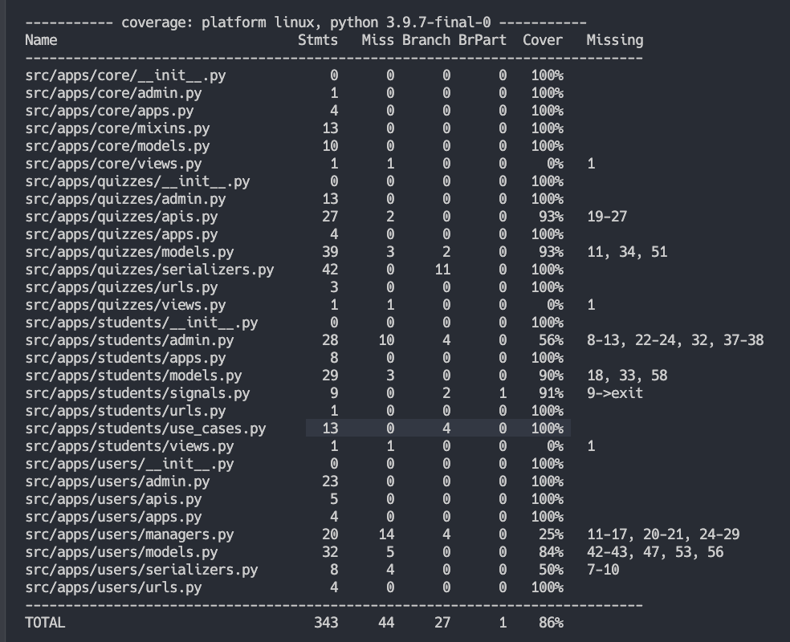
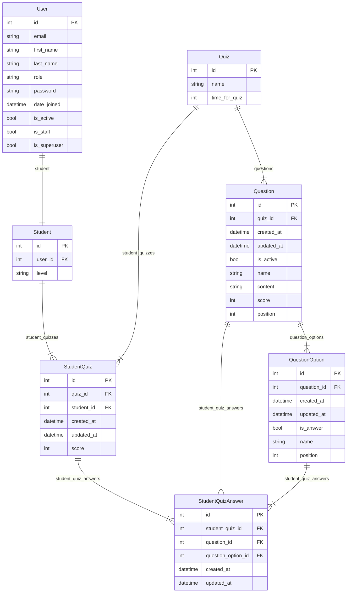

# Talataa Challenge


## Before Project Run

copy .env.template paste in docker/ and rename it with .env with their variables
## Project Run

### Build 
```
make build
```

### Run 
```
make run
```

### Run Migrations and Migrate

open other terminal
```
make migrations
```

```
make migrate
```

## Project Run Unit Test

### Run Test
```
make test
```


Image Coverage



## Entity Relationship Diagram - Main Entities


